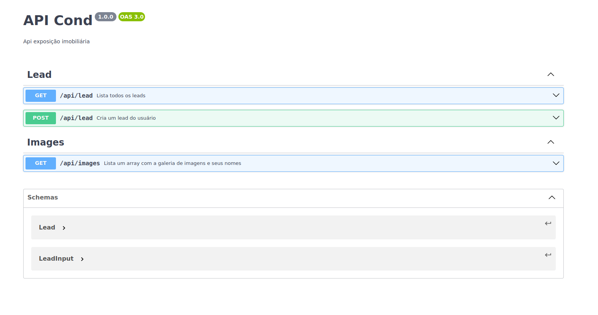

# cond-verde-serrano

## Como Rodar o Projeto

1. **Clone o Repositório:**

2. **Instale as dependencias do projeto**

#### composer install

3. **Faça o download do XAMPP**
#### inicie os servidores 

4. **Crie o Banco de Dados**
#### php artisan create:db

#### comando para fazer o drop do db: 
#### php artisan run:drop-db

5. **Rode a migration para criação da tabela lead**
#### php artisan migrate

6. **Comando para iniciar o projeto laravel**
#### php artisan serve

7. **Documentação api**
### disponivel no arquivo openapi.yaml copiar e colar no editor swagger

